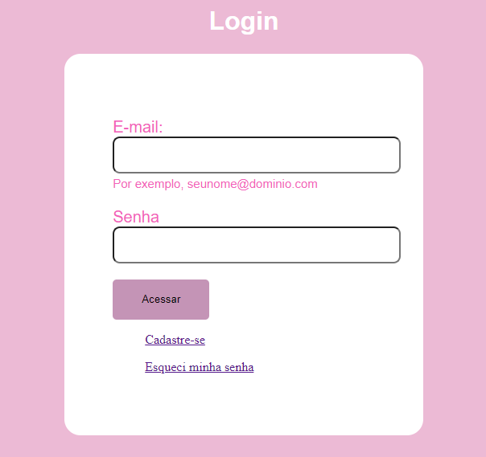
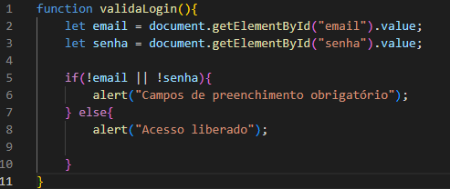
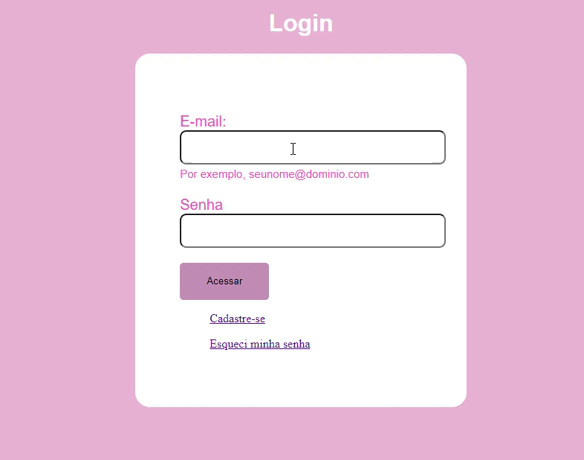

# ``Form Login V2`` 
## ``Índice``
 
* [Introdução](#introdução)
* [Descrição](#descrição)
* [Fontes Utilizadas](#fontes-utilizadas)
* [Resultado](#resultado)
* [Autores](#autores)

## ``Introdução:``
* Tela de login reutilizando códigos do trabalho form-login e alteramos as informações.

## ``Projeto utilizado``
https://github.com/camilacasagrande/form-login

## ``Descrição:``
* Criamos uma tela de login contendo os campos Email e Senha. Caso a pessoa não tiver uma conta registrada, o botão Cadastre-se ou Esqueci minha senha e por fim, botão Acessar. 
Configuramos e foi validado os campos de acesso, por exemplo, caso a pessoa não informe os campos usuário ou senha, um alert deve aparecer informando a essa pessoa que esses são campos obrigatórios a serem preenchidos. Uma página foi criada para quando o usuário clicar na opção Esqueci minha senha, permitir inserir o e-mail do usuário para a recuperação da senha.

## ``Fontes Utilizadas:``
* HTML5, CSS3 e JavaScript

## ``Código JavaScript``

## ``Resultado``

## ``Link da publicação no Linkedin :``
https://www.linkedin.com/posts/camila-casagrande_desenvolvimentoweb-javascript-html5-activity-7189265548336144384-ftvE?utm_source=share&utm_medium=member_desktop

## ``Autores:``
* Camila Casagrande
 
* https://github.com/dudafontinele
 
* https://github.com/belsil5aa

* https://github.com/manuelaaraujo